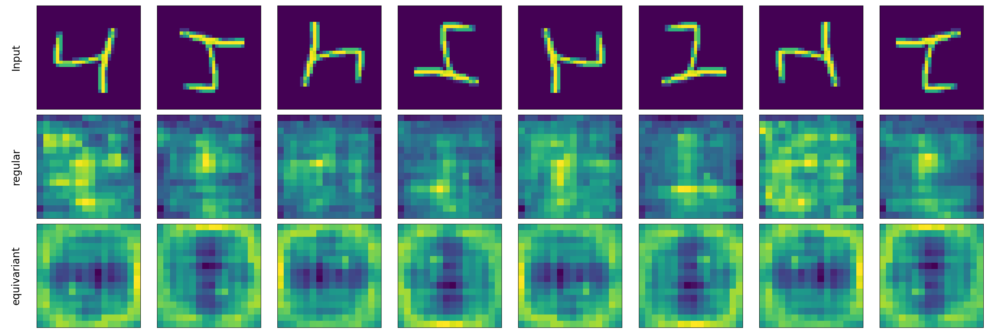

Exploration of using Aron's library [Groco](https://github.com/APJansen/GroCo) for this project.

It allows for a UNet that is equivariant to rotations and reflections.
If we write the model as M and any rotation of a multiple of 90 degrees and/or a reflection as R, and any input image as I, what this means is:

M(R(I)) = R(M(I))

i.e. we get the same result no matter if we *first* rotate the image and *then* apply the model, or if we *first* apply the model and *then* rotate the result.

The script here shows that the library has all the ingredients necessary to create an equivariant UNet. It builds a simple one and applies it to a test image from MNIST.
The result can be seen in the image below:

On the top row is an example image from MNIST, the leftmost being the original, and the other 7 all possible rotations and reflections.
Directly below is the output of a regular UNet that is not equivariant, when given the input image diretly above it.
As you can see, the outputs are not related to each other, the shapes are all different.
Note that this is an untrained model, so don't expect any meaning from the output, we're just looking at its symmetries.

The bottom row finally are the outputs of the equivariant UNet.
As you can see after some study, these are related to eachother in the same way as the input images are.
For instance the second image is the first one rotated counterclockwise by 90 degrees.
In the equivariant model's output, the same is true, for instance focus on the big blue band in the middle that goes from horizontal to vertical, or the very yellow pixels on the right edge that move to the top edge.

